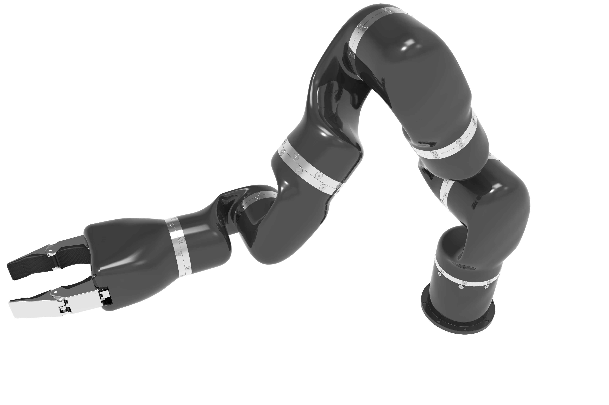

# The mra_ros_control respository

## Travis - Continuous Integration

Indigo | Kinetic
------ | -------
 |  |

**This repository is used to control real aubo's MRA(module robot arm) by ROS.** 
1. The **mra_basic** package is the driver to commuicate with the real MRA hardware and provides the some related topic of the ros control. 
2. The **mra_control** package is the abstraction of real MRA hardware. 
3. The **mra_core_msgs** package is the communication messages between mra_control and mra_basic. 
4. The **mra_joint_state_publisher** package is used to simulate MRA_API to send joint state and mra state 
5. The **ros_control** stack :See [ros_control documentation](http://ros.org/wiki/ros_control) on ros.org 
6. The **ros_controllers** stack is the implement of related ros controllers. 
7. The **moveit_visual_tools** package is the helper for displaying and debugging MoveIt! data in Rviz 

## Features

* The MRA has kinds of arm configurations composed of the module joins, such as dual arms, 7Dofs arm, 6Dofs arm, etc.
* You can only modify the configure file to suit different Dof arms, and don't need to modify the mra_basic source code.
* Support the trajectory msgs planning by move_group in MoveIt!. 
* Support safe operations in real-time.
*  Multiple kinds of control mode
    * basic position, velocity, effort.
    * controlling signle joint or arms by ros_control.
    
