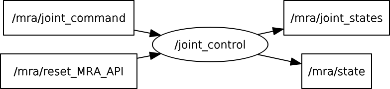

# mra_basic package
**This package is used to control real aubo's MRA(Module Robot Arm) by ROS**

There are two executable fiels: joint control and control_panel.  

When you are using mra_ros_control package to control MRA7A, you need the first step: rosrun mra_basic joint_control.  

***
**Note:**
1. In the include/mra_basic/config.h file, you can change some config. 
such as:jointID, joint_names, topic_names, etc. 
2. In the top CMakeList.txt file, you need to change the system parameter "LONG_BIT" according to your system. You can lookup the parameter by runing "getconf LONG_BIT" in the terminal 
*set(LONG_BIT "32")*  
***
Here, We provides a simple test to control MRA7A's joint independently using a QT panel. 
**Steps:** 
1.roscore 
2.rosrun mra_basic joint_control 
3.rosrun mra_basic control_panel 
***
**Design ideas:** 
joint_control:  
It's node graph as follow:  
  
It subscribes the "/mra/joint_command" topic to contorl the MRA's joint position, velocity, or effort, and the "/mra/reset_MRA_API" topic to reinit MRA_API if the canbus interrupts. Besides, It publishes the joint_states and mra_state msgs at 100 hz frequency.

